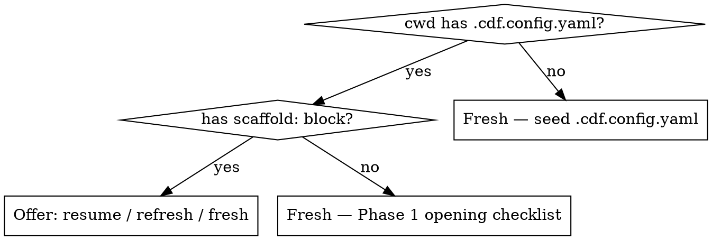

# CDF Profile Scaffold — Master Skill

Orchestrates the end-to-end scaffold of a CDF Profile YAML + Findings-Doc from
a raw design system. The Skill is the **process document**. The LLM is the
**executor** (source-inspection, synthesis, prose). The MCP (`cdf-mcp`) is the
**deterministic data-provider** (validate, coverage). The User is the
**decider** on every SoT question.

**Artefacts produced (per run):**
- `<ds>.profile.yaml` — canonical CDF Profile output (written via `Write`,
  validated via `cdf_validate_profile` v1.5.0)
- `<ds>.findings.md` — prose narrative, 4-field-per-finding, DS-meeting-ready
- `<ds>.conformance.yaml` — optional, only if any finding is classified as
  `accept-as-divergence` in Phase 6

---

## 0 · Pre-Flight (Plugin Install + Runtime Prerequisites)

This skill ships in the [`formtrieb/cdf-plugin`](https://github.com/formtrieb/cdf-plugin)
Claude Code plugin. If you are reading this in a `~/.claude/plugins/`
install — you already have it. Otherwise: `claude plugin install
formtrieb/cdf-plugin`.

**Hard prerequisites (any path):**

- Claude Code or Claude Desktop with MCP support
- Node.js ≥ 20 (the plugin's `.mcp.json` runs `@formtrieb/cdf-mcp` via
  `npx`; first invocation caches it locally)
- A target design-system directory with write permissions for
  `.cdf-cache/` and the canonical deliverables

**Host-tool prerequisites (one-time install, not per-run):**

The Phase 2/3/7 emit pipelines use standard POSIX shell utilities for
YAML/JSON extraction. The toolchain is **PyYAML-frei** — Python is used
only with its stdlib; YAML→JSON conversion goes through `yq`. A typical
macOS install: `brew install yq jq`. On Debian/Ubuntu: `apt install yq
jq python3`. (`yq` must be the **mikefarah** variant — Go-based, ≥ 4.x.
The older `kislyuk/yq` Python wrapper is NOT compatible with the
inline-jq recipes Phase 3 uses.)

| Tool | Min version | Install hint |
|---|---|---|
| `yq` (mikefarah) | ≥ 4.x | `brew install yq` / `apt install yq` |
| `jq` | any modern | `brew install jq` / `apt install jq` |
| `python3` | stdlib only — no PyYAML needed | usually pre-installed; `brew install python3` if not |
| Bash 4+ or zsh | any modern | macOS 11+/Linux: pre-installed |
| `git` | any modern | usually pre-installed; needed for the `.gitignore`-offer probe (`source-discovery.md` §6) |

To verify your environment in one shot:

```bash
bash <plugin-root>/scripts/check-host-deps.sh
```

The script returns 0 + prints the resolved versions on success, or 1 +
prints `MISSING: <tool>` on the first absent dependency.

**Path-specific prerequisites** (the skill auto-detects which path
applies — see §1.4 below; this list is here so you can pre-configure):

| Path | What you need |
|---|---|
| **T1 (REST)** — Engineer with PAT | `FIGMA_PAT` env var **or** pass `pat:` arg to `cdf_fetch_figma_file`. PAT scopes: `file_content:read` minimum |
| **T0 (runtime)** — Evaluator without PAT | `figma-console` MCP loaded in the Claude session + Figma Desktop with the target file open |
| **T2 (Variables)** — Enterprise | T1 PAT plus permission for `GET /v1/files/{key}/variables` (Enterprise plans) |

**Optional (richer regime):**

- DS-specific tokens MCP (e.g. a `tokens-studio` server) for
  `tokens-studio` regime users — the skill auto-detects via Rule A
  if loaded
- A parent CDF Profile if the new Profile inherits via `extends:`
  (single-level only per CDF v1.0)

**First-run smoke test:** with the plugin installed, type `/cdf` in
your Claude Code session — both `/cdf:scaffold-profile` and
`/cdf:snapshot-profile` should appear. If they don't, restart the CC
session to re-discover plugin components.

**Tip — batch the deferred-tool schemas at session start.** Most
runs use the same eight tools across walker invocation + render +
optional figma probes + dialog/todo; load all schemas in one round-trip
rather than lazy per-tool:

```
ToolSearch(query="select:mcp__plugin_cdf_cdf-mcp__cdf_fetch_figma_file,mcp__plugin_cdf_cdf-mcp__cdf_extract_figma_file,mcp__plugin_cdf_cdf-mcp__cdf_render_snapshot,mcp__plugin_cdf_cdf-mcp__cdf_validate_profile,mcp__figma-console__figma_get_variables,mcp__figma__get_variable_defs,AskUserQuestion,TodoWrite", max_results=10)
```

The `mcp__plugin_<plugin>_<server>__<tool>` namespace prefix is mandatory
for plugin-loaded MCP-tool selectors — bare slugs (`cdf_fetch_figma_file`)
do NOT match, and neither does the unqualified `mcp__<server>__<tool>`
form. The `plugin_cdf` segment derives from the cdf plugin-name; the
`cdf-mcp` segment is the server-name declared in the plugin's
`.mcp.json`. Plugin-loaded tools are ALSO lazy-discovered: the first
`cdf_fetch_figma_file` invocation at session start triggers the plugin's
MCP-tool surface to register, after which subsequent ToolSearch matches
succeed. **You may still see one ToolSearch round-trip on first MCP-tool
call** even with this batch hint, because the plugin's tool surface is
lazy. Subsequent calls within the session are batch-resolved.

**If you installed `cdf-mcp` directly via `.mcp.json` instead of the
cdf plugin** (uncommon for evaluators), substitute your local
server-name as declared in that `.mcp.json`: the selector becomes
`mcp__<your-server-name>__cdf_fetch_figma_file`. The selector pattern
is `mcp__<configured-server-name>__<tool>` for direct installs, vs
`mcp__plugin_<plugin>_<server>__<tool>` for plugin installs.

Saves ~5 round-trips (~1–2 min) compared to lazy per-tool loading.
(v1.0.7 runtime-smoke retro item 8 — 4× ToolSearch round-trips per
session because v1.0.7 shipped bare-slug names that did not match.)
If `max_results=10` returns truncated, fall back to two batches of four.
Mirrors the same tip in `cdf-profile-snapshot/SKILL.md` §0.

---

## 0.5 · Read-Path Resolution

All `Read`/`yq`/`jq` paths in this skill and its `references/` + `shared/`
docs resolve **relative to the directory containing this SKILL.md**, not
relative to the user's `cwd`. Two consequences:

1. **You can call `Read references/synthesis.md` directly.** No `ls`-
   discovery needed. The Read tool resolves the relative path against
   the SKILL.md base.
2. **If a Read fails with "file does not exist"** because relative-path
   resolution didn't pick up SKILL.md as anchor, locate the skill root
   ONCE via `find ~/.claude/plugins -name SKILL.md -path "*<skill-name>*"`
   and prefix subsequent reads with the resulting absolute path. Cache
   the path; do NOT re-discover per Read.

This anchor applies to:
- `references/*.md` (skill-internal)
- `../../shared/cdf-source-discovery/*.md` (shared refs)
- `../../shared/<other>/...` (any future shared module)

---

## 1 · Entry Points & Opening UX

### 1.1 Invocation

The Skill fires on:
- Slash-command `/scaffold-profile [free-form context]`
- Direct user request matching the description triggers (see frontmatter)

Either way the Master **reads this SKILL.md first**, then on Phase entry the
matching `references/phases/phase-N-*.md` is read via `Read`.

### 1.2 Resume / Refresh / Fresh

At Phase 0 (before Phase 1 fires), **check the current working directory for
`.cdf.config.yaml`** and whether it has a `scaffold:` block.



**Three options when `scaffold:` block is found:**

| Option | Action |
|---|---|
| `resume` | Continue from `scaffold.last_scaffold.phases_completed[-1] + 1`. Re-confirm ds_name + figma.file_url, skip Phase 1 opening checklist. |
| `refresh` | Re-run from Phase 1 using stored values as pre-filled answers. User can override any. |
| `fresh <name>` | Treat as new DS. Overwrite `scaffold:` block after confirmation. |

### 1.3 Opening Checklist (Phase 1 — three-tier advisor tone)

Canonical content lives in
`../../shared/cdf-source-discovery/source-discovery.md` §1. `Read` that
file **at point-of-need** — when actually initiating the opening dialog
with the User (not upfront before Phase-0). Covers required (DS name,
Figma URL), quality-critical (token-source regime, parent-Profile
inheritance), and nice-to-have inputs in advisor (not gatekeeper) tone.

The shared doc carries the full message text the LLM emits; this skill
contributes nothing to the checklist beyond what's in shared.

**Rule A applies from here forward** — every "where does X live?" question
before every source inspection.

### 1.4 Tier Detection (Phase-0.5)

Canonical content lives in
`../../shared/cdf-source-discovery/source-discovery.md` §2. `Read` that
file **at point-of-need** — when running tier-detection at Phase-0.5.
Covers the F6-corrected probe-first algorithm (T2 → T1-legacy-cache →
T1-modern-probe → T0 → halt), backwards-compatibility note, and the
pluggable-resolver slot for the Variable-ID → path mapping.

Tier detection writes `scaffold.tier` into `.cdf.config.yaml`. Phase-1's
T1/T2 branch consumes `scaffold.tier`; Phase-4 (Theming) consumes the
resolver output without knowing which backend filled it.

The probe-first algorithm enforces the **Rule B — Capability-Probe Before
Default-Fallback** discipline (`tool-leverage.md` §3): legacy-cache
absence is not equivalent to T1-unreachability, and silent T0-fallback
costs 30–45 min of `figma_execute` enumeration per mature DS.

### 1.4-bis Output Layout — `.cdf-cache/` convention

Canonical content lives in
`../../shared/cdf-source-discovery/source-discovery.md` §6. `Read` that
file **at point-of-need** — when the workflow first writes to
`.cdf-cache/` (typically end of Phase 1). Covers the
cache-vs-canonical-vs-deliverable split, the `mkdir -p` contract, and the
`.gitignore` recommendation.

Scaffold-specific examples for each category:
- **Cache:** `phase-1-output.yaml` … `phase-5-output.yaml`
- **Canonical user-input:** `<ds>.findings.yaml` (Phase 6 output)
- **Deliverables:** `<ds>.profile.yaml`, `<ds>.findings.md`,
  `<ds>.conformance.yaml`, `<ds>.housekeeping.md`

The `.gitignore` opt-in offer goes into the §7.7 handback (Phase 7).

### 1.5 Auto-Mode (Benchmark / Evaluation only)

For performance-benchmark or evaluation runs — *never* for production
Profile authoring — the Skill supports **auto-mode**. User opts in
explicitly via `scaffold.auto_mode: true` in `.cdf.config.yaml` or via
invocation flag (`/scaffold-profile --auto` / "run in auto-mode").

**What auto-mode does:**

- Skips all 🔴 / 🟡 / 🟢 opening-checklist User-dialog; fills from
  config defaults (DS-name from directory, Figma URL + fetch-file from
  config, token-regime from config, identifier = first 3 chars of
  ds_name, `extends: null`).
- Skips Phase-6 Findings **classification** (observation-fill still
  happens — findings.md is a TODO-list for a real run later).
- Writes Profile artefact with `_auto.profile.yaml` suffix (not
  `.profile.yaml`) — **not confusable with production Profiles**.
- Emits this banner at the top of the Profile file:

  ```yaml
  # ⚠ AUTO-SCAFFOLDED — BENCHMARK / EVALUATION ONLY
  # Decisions taken via config defaults, NOT User-validated.
  # Findings-doc is an unclassified TODO-list. This file is NOT a
  # production Profile. A real scaffold must replay Phase 6 with User.
  ```

- Emits timing report to `<ds-test-dir>/<ds>.auto-run-timing.md` with
  per-phase durations.

**Rule-E compliance:** auto-mode is explicit, transparent, and
artefacts are clearly marked. This is *not* the autopilot failure mode
(see `feedback_test_prompt_framing`). Autopilot-failure is
*silently* defaulting User-dialog because a framing like "autonomous"
was misinterpreted. Auto-mode is the *opposite* — User explicitly
requests it, output is explicitly tagged.

**When it's valid:**

- Performance benchmarks (e.g. measuring T1 vs T0 Phase-1 speedup)
- DS-onboarding previews ("what would this DS look like as a Profile?")
- Smoke-testing the skill after changes

**When it's not valid:**

- Producing a Profile anyone will consume (generators, reviewers,
  extends-chain children)
- Any situation where Rule-E's "User decides every SoT question"
  contract matters

---

## 2 · The 8 Meta-Rules (A – H)

These are the Skill's backbone. Every rule is derived from the v1.4.0 design
walkthrough — a mistake made or a success validated while walking a real DS
end-to-end. Follow them in every phase.

### Rule A · Survey First (sources & tools)

Canonical content lives in
`../../shared/cdf-source-discovery/tool-leverage.md` §1. `Read` that
file **at point-of-need** — at first source inspection, not upfront.
Covers the three-step discipline (ask WHERE → check tools → raw-parse
last), the LLM default-trap explanation, and the spec-reads-via-
`cdf_get_spec_fragment` corollary.

Companion rule: §2 (Rule A Enforcement: Tool-Survey BEFORE Resolver-Gap)
hard-rules out paraphrased capability-gap claims; §3 (**Rule B —
Capability-Probe Before Default-Fallback**, sister to Rule A) hard-rules
out tier-fallbacks that skip the probe. Both are auto-mode-load-bearing.

Each phase-doc preamble lists the spec fragments relevant to that phase
and declares its `requires:` shared-doc deps in YAML frontmatter for
grep-verification.

### Rule B · Truncation-Awareness

When a tool output is truncated (`search_tokens` at 100 results, `use_figma`
at ~20kB, etc.), **never rely on the partial dataset**. Re-query with narrower
scope, use `browse_tokens` with `path_prefix`+`depth` for complete enumeration,
or paginate explicitly.

**Field observation:** a token-search call returned "Showing 100 of 192" —
only 3 of 6 hierarchies visible. Half the vocab-axis would have been missed
without this rule.

### Rule C · Verify, Don't Trust

Verify User-claims AND your own earlier LLM-conclusions against data before
baking into findings. The act of verifying surfaces adjacent findings you'd
otherwise miss.

**Field observation:** a User-claim about a token family turned out wrong;
the verification attempt surfaced a different, real DTCG ↔ Figma count
delta that would otherwise have gone unnoticed.

### Rule D · Tool-Agnosticism

Skill describes WHAT to find and WHY, not WHICH tool to invoke (except for
near-universal constants: `figma-mcp`, `cdf-mcp`). For DS-specific tools,
Rule A applies — Skill says "ask the User what's available, adapt."

**Why:** every DS-specific tool-name baked into instructions is a regression
for the next DS-architect.

### Rule E · Source-of-Truth Advisor

The Skill is **not documentation-as-is**. It is **decision-aid for
canonicalization**. Every detected discrepancy (drift, sparsity, orphan,
mismatch, double-representation) becomes an explicit "which side is
authoritative?" question for the User. The LLM **recommends with rationale**,
the User decides. Decisions land in the Profile as fact, in the Findings-Doc
as history.

**This is the Skill's core value-add over Tokens Studio.** Tokens Studio never
asks for intent; it just records state. The Skill asks the right questions at
the right time.

**COVERAGE rule (Phase 6):** "every finding" means *every* finding,
including ones where the SoT-recommendation is "obvious." The User
confirms the obvious call in one keystroke via preselected default;
the audit trail stays intact. Silent-auto-deciding "easy" findings is
a contract violation dressed as optimization — see
`references/phases/phase-6-findings-classify.md` §6.4.

**Autopilot is not a valid mode.** If the User cannot be reached (no
interactive channel, headless session, or framing like "run autonomously"
/ "don't ask" / "record don't fix"), do NOT auto-decide every SoT-question
and mark the decisions `llm-auto:*`. That hides the contract-violation
behind a formatting convention. Instead:

1. Halt the phase that needs User input.
2. Emit every unresolved finding as `block` with the SoT-recommendation
   preserved verbatim (Phase 6's `block` decision-type exists exactly
   for this).
3. Return control to the invoker with a clear summary of how many
   findings are still open.

A `block`-heavy scaffold emitted from a non-interactive session is the
expected shape. A User-reachable session completes Phase 6 later against
the same findings-doc.

**Framing-test before Phase 2 starts:** Re-read the invocation. If it
contains "autonomous" / "without asking" / "record don't fix" and you
interpret that to apply to User-dialog pauses, you have misread the
framing. Those instructions scope NARROWLY to skill-side patching (if
you notice a skill-text gap, record it — don't edit the skill mid-run).
User-dialog is a first-class Rule-E output, not an interruption to
minimize.

### Rule F · Utility-Components Awareness

Not all DS functionality lives in variants. Shared utility components (focus
rings, dividers, tooltip backdrops, animation wrappers) implement cross-cutting
concerns by composition, not by variant-properties. Without this
classification, A11y- / Interaction-analysis is incomplete.

**Heuristic:** After enumerating COMPONENT_SETs, classify standalone COMPONENTs
by role (Utility / Documentation / Widget / Asset) via name patterns + User
confirmation.

**Field observation:** an initial claim "this DS has no focus design" turned
out wrong — the DS had a standalone `Focus Ring` component used
compositionally via doc-frames. Invisible to pure variant-axis analysis.

### Rule G · Documentation-Frames as First-Class Input

Many DSes have `_doc-content` frames (or similar) per component containing
author-intended documentation: Best Practices, Focus-Strategy, Property
semantics, Responsiveness rules. **This is more authoritative than any
LLM-inference from variants.** Author intent beats inferred intent.

**Protocol:** Look for naming patterns (`doc`, `_doc`, `docu`, `documentation`,
`description`). If present: ingest FIRST, infer SECOND.

### Rule H · Documentation-Surfaces Ingestion

Before assuming intent/purpose/pattern, check if the DS-author has documented
it. Phase 1 must enumerate all documentation surfaces:

- Token descriptions (DTCG `$description`)
- Component descriptions (Figma built-in)
- Annotations on nodes (Figma sticky-note system)
- Doc-frames (Rule G)
- External docs (Confluence/Notion/Storybook — User-pointed only)

Triage matrix (Profile vs Component scaffold relevance):

| Surface | Profile-Level | Component-Level |
|---|---|---|
| DTCG `$description` on tokens | ★ (intent, deprecation) | — |
| Figma Component Description | ★ (category hints) | ★★ |
| Figma Annotations | — | ★★ (A11y, tab-order) |
| Doc-frames (`_doc-content`) | ★★ (systemic patterns) | ★★ (component specifics) |
| External docs | ★ (on request) | ★ |

---

## 3 · Phase Overview & Lookup Table

Seven phases, each in its own `references/phases/phase-N-*.md` file. Read the
phase-doc **when the phase fires** — not upfront.

| Phase | Goal | References file | Typical tool usage |
|---|---|---|---|
| 1 · Orient | Map DS: components, libraries, theming axes, doc-surfaces, token regime | `references/phases/phase-1-orient.md` | **T0**: `use_figma` (Plugin-JS) enumeration + figma-mcp → `phase-1-notes.md`. **T1/T2**: `cdf_fetch_figma_file` + `cdf_extract_figma_file({source:"rest"})` (~3 s; deprecated bash twin: `scripts/extract-to-yaml.sh`) → `phase-1-output.yaml` (version-tagged `phase-1-output-v1`; Phase 2 hard-asserts) + pluggable resolver (tokens-MCP / Plugin-cache / Enterprise-REST). Tier auto-detected §1.4. |
| 2 · Vocabularies | Aggregate variant-axes → system-level vocabularies; detect clashes + decomposition candidates | `references/phases/phase-2-vocabularies.md` | **T1/T2:** inline `jq` over `phase-1-output.yaml` seeds `axis_inventory` + Z/B finding candidates → `phase-2-output.yaml` (version-tagged `phase-2-output-v1`). **T0:** legacy `<ds>.phase-2-notes.md`. Optional `cdf_vocab_diverge`. |
| 3 · Grammars | Identify token-grammar patterns, sparsity, aliases, component bindings | `references/phases/phase-3-grammars.md` | **T1/T2:** DS-tokens MCP (`list_token_sets`, `find_placeholders`, `browse_tokens`) + inline jq seeders → `phase-3-output.yaml` (version-tagged `phase-3-output-v1`). **T0:** legacy `<ds>.phase-3-notes.md`. `get_variable_defs` on reps. |
| 4 · Theming | Derive theming-modifier axes, mode-sparsity, component-layer gaps | `references/phases/phase-4-theming.md` | **T1/T2:** `list_themes` + per-mode `browse_tokens`/`compare_themes` seeds `mode_sparsity` + `orphan_modes` → `phase-4-output.yaml` (version-tagged `phase-4-output-v1`). **T0:** legacy `<ds>.phase-4-notes.md`. `use_figma` for collection/mode enum when regime = figma-variables. |
| 5 · Interaction + A11y | Classify interaction patterns, utility-components, focus-strategy | `references/phases/phase-5-interaction-a11y.md` | 100% LLM synthesis; **T1/T2:** `phase-5-output.yaml` (version-tagged `phase-5-output-v1`) captures synthesis in named slots. **T0:** legacy `<ds>.phase-5-notes.md`. Optional `get_design_context` for Annotations. |
| 6 · Findings + Classify | Aggregate seeded findings across phases, classification decision tree, multi-artefact emit | `references/phases/phase-6-findings-classify.md` | Aggregate `seeded_findings[]` from `phase-{1..5}-output.yaml` → `<ds>.findings.yaml` (canonical, `findings-v1`) → `cdf_render_findings` MCP tool emits `<ds>.findings.md` (deprecated bash twin: `scripts/render-findings.sh`) / `<ds>.conformance.yaml` / `<ds>.housekeeping.md`. AskUserQuestion COVERAGE per Rule E. T0 not currently consumable here — see phase-doc §6.0. Optional `cdf_overlay_emit` when spec lands. |
| 7 · Emit + Validate | Materialize YAML, validate, coverage | `references/phases/phase-7-emit-validate.md` | `Write` (Profile/findings/conformance YAMLs), `cdf_validate_profile` (L0–L7 default, L8 opt-in), `cdf_coverage` (component-spec scope), optional `cdf_suggest` |

**Lookup rule:** *When Phase N starts, `Read` `references/phases/phase-N-*.md`
before doing any Phase-N work.* The phase-doc contains methodology, tool
template, subagent guidance, pitfalls, and completion gates.

### 3.1 Subagent Usage (SD5 summary)

| Phase | Nature | Subagent-fit |
|---|---|---|
| 1 | Enumerate Figma tree + tokens → research-heavy | ★★★ |
| 2 | Synthesis + User-loop | ✗ |
| 3 | Token-tree scan + pattern-match → research-heavy | ★★★ |
| 4 | Mode cross-check + SoT-decisions | △ hybrid |
| 5 | Classify + User correction (Focus Ring!) | ✗ |
| 6 | Rule E — User classifies every finding | ✗ |
| 7 | Deterministic cdf-mcp | — |

Subagents in dialog-phases (2, 5, 6) would break Rule E — they cannot pause to
ask questions. Per-phase subagent guidance lives in each phase-doc.

---

## 4 · Findings Schema (canonical) + Rendered Views

**Canonical artefact:** `<ds>.findings.yaml`
(`schema_version: findings-v1`). Aggregated by Phase 6 from
`seeded_findings[]` across phase-1 through phase-5 output YAMLs.
Shape reference: `references/phases/templates/findings.schema.yaml`.

```yaml
schema_version: findings-v1
ds_name: <string>
generated_at: <ISO>
findings:
  - id: "§p<N>-<original-id>"  # phase-prefixed on aggregation
    cluster: A | B | C | D | E | Y | Z
    title: <string>
    observation: <string>
    discrepancy: <string>           # optional
    sot_recommendation: <string>    # optional
    user_decision: pending | adopt-as-is | adopt-DTCG | adopt-Figma |
                   adopt-Components | accept-as-divergence | defer |
                   drop | block
    source_phase: <int 1..5>
    # Lever-5 prose-quality fields (required for cluster A/B/C/D):
    plain_language: <string>            # ≤50 words, jargon-free
    concrete_example: <string>          # real values from User's DS
    default_if_unsure: { decision, rationale }
    # optional: instances[], threshold_met, interpretation_note, related[]
summary:
  total_findings: <int>
  by_cluster: { A: int, B: int, ..., Z: int }
  by_decision: { adopt-as-is: int, ..., defer: int, block: int, pending: int }
  ship_blockers: [<id of decision == block>, ...]      # STOPS RELEASE
  deferred_findings: [<id of decision == defer>, ...]  # advisory; ships
```

**`block` vs `defer` — read this.** `block` means "Profile MUST NOT
ship until resolved" (true ship-blocker). `defer` means "User wants
to revisit later, no rush; Profile ships normally." The 2026-04-25
real-run hit a 30% block rate primarily because the User chose `block`
when the actual mental-state was "I'm unsure" — `defer` is the right
value for that case. Use `block` sparingly. Full decision-matrix in
`references/phases/phase-6-findings-classify.md` §6.3.

**T1/T2 path — rendered views** (via `cdf_render_findings` MCP tool;
deprecated bash twin: `scripts/render-findings.sh`):

- `<ds>.findings.md` — DS-meeting-ready prose, cluster headings,
  4-field-per-finding block. Always emitted.
- `<ds>.conformance.yaml` — divergence overlay, one entry per
  `accept-as-divergence` finding. Emitted always; consumers check
  `divergences | length > 0` to decide whether to ship.
- `<ds>.housekeeping.md` — cluster-Z sibling file, only when
  Z-count > 10 (threshold mirrored in renderer + skill).

**Rendered findings.md template** — what `cdf_render_findings`
(or the deprecated `scripts/render-findings.sh --findings-md`)
produces per finding (for reference; do not hand-author):

```markdown
### §p<N>-<id> · [Finding Title]

**Observation:** [what the source(s) actually say — quote data, not inference]

**Discrepancy:** [DTCG says X, Figma says Y, Components say Z — OR omitted
when there is no two-sided discrepancy]

**Source-of-Truth-Recommendation:** [Which side to canonize, with rationale.
LLM authors this. The User decides.]

**User-Decision:** [adopt-as-is / adopt-DTCG / adopt-Figma / adopt-Components /
accept-as-divergence / defer / drop / block — filled during Phase 6]
```

**Cluster by architectural concern, not chronologically.** The v1.4.0
walkthrough established seven canonical clusters:

- **A · Token-Layer Architecture** — grammar patterns, aliases, drift
- **B · Theming & Coverage** — mode-sparsity, brand-drift, orphan axes
- **C · Component-Axis Consistency** — vocab divergence, compound states, property-name drift
- **D · Accessibility Patterns** — focus strategy, utility components
- **E · Documentation Surfaces** — doc-frame ingestion, external docs
- **F · CDF-Format Gaps** — **separate artefact**, not DS-scoped findings.md;
  goes to `docs/specs/cdf-profile-spec-v1.1.0-issues.md` or similar
- **Z · Housekeeping** — quality/naming cleanup surfaced during inspection:
  typos in axis values or component names, trailing whitespace, `_test/*` /
  `_showcase/*` leftovers in production files, unnamed components, orphan
  previews, family proliferation / dedupe candidates, duplicate set names,
  casing inconsistency. Individually trivial, but the list is a useful
  backlog for a maintenance sprint. Use §Z1, §Z2, … as id-prefix — signals
  "low priority but worth fixing" rather than architectural decision. May
  be 4-field-abbreviated (Observation only, no SoT recommendation needed
  for a clear typo).

  **Expected volume:** a mature real-world DS typically surfaces
  **10–30 §Z entries** on first scaffold (calibrated against a
  2026-04-19 real-run — 25 entries on a DS with mature-but-messy
  legacy drift, upper-edge for mature DSes; cleaner DSes land in 10–20). Don't be
  discouraged by the count. If **§Z > 10 entries**, separate them into a
  sibling file `<ds>.housekeeping.md` linked from the findings-doc — keeps
  the
  architectural §A–E findings scannable without drowning them in typos.
  If **§Z ≤ 10**, keep them inline at the end of the findings-doc under a
  `## Housekeeping (quality / naming)` section.

---

## 5 · Persistence — `.cdf.config.yaml` `scaffold:` Block

Extends the existing `.cdf.config.yaml` pattern (non-breaking — unknown keys
ignored by validator + other consumers). Write / update this block at the end
of each phase.

```yaml
# existing fields (keep as-is)
spec_directories: [./specs]
token_sources: [./tokens/]
profile_path: ./formtrieb.profile.yaml

# NEW — maintained by this Skill
scaffold:
  ds_name: formtrieb                     # 🔴 required
  figma:
    file_url: https://figma.com/design/… # 🔴 required
    file_cache_path: ./data/library.file.json  # 🟢 T1/T2 — REST fetch on disk
  tier: T1                               # auto-detected §1.4; User can override to force T0
  auto_mode: false                       # §1.5 — true only for benchmark/evaluation runs
  token_source:
    regime: tokens-studio                # tokens-studio|dtcg-folder|figma-variables|figma-styles|enterprise-rest|none
    path: ./tokens/
    quality_rating: 3                    # 1-3 stars (0 when regime=none)
  resolver:                              # 🟡 T1/T2 only — Variable-ID → path mapping
    kind: tokens-mcp                     # tokens-mcp | plugin-cache | enterprise-rest
    mcp_name: formtrieb-tokens           #   (tokens-mcp) DS-specific MCP name
    cache_path: ./figma-cache/variables.json  # (plugin-cache) local cache location
  ds_mcp: formtrieb-tokens               # 🟢 optional — DS-specific MCP name (legacy field; use resolver.mcp_name)
  doc_frames:
    convention: _doc-content             # 🟢 optional
  external_docs: []                      # 🟢 optional
  last_scaffold:
    timestamp: 2026-04-21T10:15Z
    skill_version: 1.4.0
    tier_used: T1                        # actual tier at run-time
    auto_mode_used: false                # true → artefact names got `_auto` suffix
    phases_completed: [1, 2, 3, 4, 5, 6, 7]
    artefacts:
      profile: ./formtrieb.profile.yaml
      findings: ./formtrieb.findings.md
      conformance: ./formtrieb.conformance.yaml   # only if at least one divergence
      timing_report: ./formtrieb.auto-run-timing.md  # only if auto_mode_used
```

**Spec formalization:** the `scaffold:` block is deferred to CDF Profile Spec
v1.1.0 (Plan 2). Implementation writes the fields today; formal schema follows.

---

## 6 · Working Style — Core Discipline

- **Announce the phase before starting it.** "Entering Phase N — reading
  references/phases/phase-N-*.md."
- **Never skip Rule A.** If you don't know where a source lives, ask.
- **Never trust a single tool-call to full-enumerate.** Rule B.
- **Every detected discrepancy is a finding candidate.** Rule E.
- **Utility components + doc-frames** before variant-analysis. Rules F + G.
- **The User decides every SoT question** — you recommend, they choose.
- **Findings-prose talks DS-architect-speak, not CDF-format-speak**
  (Lever 5). Every cluster A/B/C/D finding seeded in Phases 2–5 carries
  `plain_language` (≤50 words, jargon-free), `concrete_example` (real
  values from the User's own DS), and `default_if_unsure: { decision,
  rationale }` per `references/phases/templates/seeded-findings.schema.yaml`.
  The User's Phase-6 decision quality depends directly on prose
  comprehension — the 2026-04-25 real-run hit a 30% block rate
  primarily because findings read as jargon. Phase-6 AskUserQuestion
  uses `plain_language` as the primary question text and pre-selects
  `default_if_unsure.decision` as the default. Per-phase examples in
  each phase-doc preamble.
- **`plain_language` MUST NOT cite Profile spec sections or CDF
  format-terminology (Lever 5.I).** Forbidden inside `plain_language`:
  `§…` references, bare format terms like `Profile`, `vocabulary
  isolation`, `axis-value collision`, `system-vocabulary`,
  `token-grammar`, `interaction pattern` (as a CDF concept). Why: the
  field exists to give a User who has never read CDF-PROFILE-SPEC a
  one-keystroke decision; spec-citation defeats that. For *meta*
  findings (one finding cross-referencing another, or one that exists
  only because of a CDF-format constraint), restate the symptom in
  concrete DS terms — *what does the User see in their components or
  tokens?* — and keep the mechanism description in `observation` or
  `sot_recommendation`. The 2026-04-25 evening re-run produced three
  cluster-C entries (§p2-C12/C13/C14) where `plain_language` leaked
  "Profile §5.5" / "System-Vokabularen"; the rule landed retroactively
  to prevent recurrence.
- **At decision points, prefer a tool-based ask-with-options.** When the
  host surfaces a structured-ask tool (`ask_user_input_v0` in Claude
  Desktop, `AskUserQuestion` in Claude Code, or equivalent), use it with
  options drawn from Rule E's decision vocabulary (`adopt-as-is`,
  `adopt-DTCG`, `adopt-Figma`, `adopt-Components`,
  `accept-as-divergence`, `defer`, `drop`, `block`). Option order:
  most-common first, hardest-consequence-most-explicit last —
  `block` always renders as "STOPS RELEASE" so its gravity is
  unambiguous vs. `defer` ("revisit later — Profile still ships").
  If no structured-ask tool is available, fall back to a **numbered
  prose list** so the User can answer with just the number.
- **Batch "obvious adopt-as-is OR defer" findings in Phase 6 (narrow contract).**
  In Phase 6, findings meeting ALL five conditions in
  `references/phases/phase-6-findings-classify.md` §6.4-bis (cluster
  ∈ {A, B, E} + clean discrepancy + `default_if_unsure.decision ∈
  {adopt-as-is, defer}` + no block signal + no User request for
  individual pacing) MAY be batched 3–6 at a time into a single
  two-option AskUserQuestion ("Confirm all N" / "Review individually").
  Default is "Confirm all" so the User accepts with one keystroke.
  This preserves Rule E COVERAGE (every finding surfaced, every
  decision explicit) while halving round-trips on clean-pattern cases.
  **Batching is narrow by design** — cluster-C refactors, cluster-D
  accessibility judgment-calls, conditional SoT-recommendations, and
  anything not unambiguously batchable asks individually. When in
  doubt, don't batch.
- **"Record don't fix" applies NARROWLY.** Framings like "empirical test
  run" / "record skill-gaps" / "don't fix mid-run" scope ONLY to
  skill-side patching (if you notice a skill-text issue during a run,
  write it down, don't edit the skill mid-run). They do NOT apply to
  User-dialog pauses. User-dialog is a first-class Rule-E output, not
  an interruption to minimize. If a prompt says "run autonomously" and
  no User is reachable, follow Rule E's fallback: halt + emit `block`
  findings + return control. See Rule E §2 for the full autopilot-
  counter.
- **Findings-doc is the killer artefact.** Treat it as deliverable-one, not
  a byproduct.
- **One scratch file per phase.** Write intermediate notes (inventory data,
  aggregation tables, decomposition proposals) to
  `<ds-test-dir>/<ds>.phase-N-notes.md` — not into `<ds>.findings.md`
  directly. The findings-doc stays architectural, the phase-notes hold the
  working-out. This survived run3 as a clean convention; later phases can
  cite back to earlier phase-notes for evidence without re-deriving.
- **`use_figma` calls take a descriptive `description` param.** E.g.
  `"Pass-1 Batch A — propertyDefinitions for pages 0–30 (preferredValues
  stripped)"`. Makes the tool-call log self-auditing for Rule-B reviews.

---

## 7 · Pre-Phase-1 Checklist

Before invoking Phase 1:

- [ ] `.cdf.config.yaml` checked — resume / refresh / fresh decided.
- [ ] **Tier detected (§1.4)** — `scaffold.tier` set to T0/T1/T2 based on
      file-cache-path presence. T1/T2 also confirms `resolver.kind`.
- [ ] **Auto-mode flag checked (§1.5)** — if `scaffold.auto_mode: true`,
      Rule-E dialog will be skipped and artefact names get `_auto`
      suffix. Otherwise full dialog.
- [ ] 🔴 `ds_name` + `figma.file_url` confirmed (hard-stop if missing
      and not in auto-mode; auto-mode fills from directory / config).
- [ ] 🟡 token-source regime identified + ★-rating recorded.
- [ ] 🟢 DS-specific tooling + doc-frame convention asked (adapt if known).
- [ ] User given the three-tier opening message (advisor tone, not
      gatekeeper) — **skipped in auto-mode**.
- [ ] `scaffold:` block seeded in `.cdf.config.yaml`.

Then: `Read` `references/phases/phase-1-orient.md` and begin.
Phase 1 branches internally on `scaffold.tier` (see phase-doc §8 for
the T1/T2 mechanical path).

---

## 8 · Related Skills

- `cdf-author` — authors individual component specs once Profile is stable.
- `component-review` — reviews a component spec against the Profile.
- `token-audit` — audits token-coverage across specs.
- `figma:figma-use` — Plugin-JS execution (required prerequisite for
  `use_figma` calls in Phase 1).
- `superpowers:dispatching-parallel-agents` — reference for Phase-1 / Phase-3
  subagent dispatch patterns.
