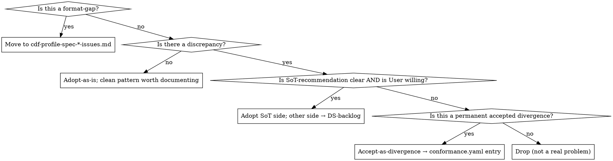

# Phase 6 · Findings + Classify

**Goal:** Collate every finding seeded across Phases 1–5 into a single
`<ds>.findings.md` document; run each through the classification
decision-tree with the User; emit the final artefact set. This is where
the Skill earns its keep as Source-of-Truth Advisor (Rule E).

**Predecessor:** Phases 1–5 all seeded findings as they surfaced. By
Phase 6 start, `<ds>.phase-N-notes.md` scratch files hold the raw
evidence; the findings-doc holds the 4-field entries (mostly with
empty User-Decision fields).

**Successor:** Phase 7 (Emit + Validate) — deterministic pipeline.

**Subagent-fit:** ✗ — Rule E demands User dialog on every classification.
A subagent cannot pause to ask "adopt-DTCG or accept-as-divergence?"
Stay in main session.

---

## 1 · Methodology

### Step 6.0 — Locate phase inputs (version-assert every upstream YAML)

By Phase 6 start every phase 1–5 has emitted a version-tagged YAML
(`phase-N-output.yaml`). Assert the schema version BEFORE iterating:

```bash
for N in 1 2 3 4 5; do
  V=$(yq '.schema_version' <cwd>/.cdf-cache/phase-$N-output.yaml 2>/dev/null)
  EXPECTED="phase-$N-output-v1"
  if [ "$V" != "$EXPECTED" ]; then
    echo "FAIL: .cdf-cache/phase-$N-output.yaml has schema_version=$V, expected $EXPECTED"
    exit 1
  fi
done
```

If any file is missing or the version doesn't match, **hard-fail** —
do not attempt to interpret it. Ask the User to re-run the offending
phase.

**T0 path:** Phase 6 is YAML-only as of the Lever-2A Scope-A
end-to-end validation (2026-04-23 — see DIARY). T0 scaffolds that
emit markdown phase-notes are not consumable by this phase. T0-mode
users must either run with T1 (cache the Figma file via
`specs-cli fetch` per SKILL.md §1.4 detection) OR convert their
`<ds>.phase-N-notes.md` to the YAML shape before Phase 6. Extending
mechanical seeding into the T0 walker is a separate lever (parked
in `project_scaffold_optimization_levers`).

### Step 6.1 — Collate findings from all prior phases

Assemble the canonical `<ds>.findings.yaml` (shape per
`references/phases/templates/findings.schema.yaml`) by aggregating
every `seeded_findings[]` from `phase-1-output.yaml` through
`phase-5-output.yaml`. Each entry's id is prefixed with the source
phase to avoid collisions:

```bash
DS=<ds_name>
OUT=<ds-test-dir>/$DS.findings.yaml
PHASE_YAMLS=$(ls <ds-test-dir>/.cdf-cache/phase-{1,2,3,4,5}-output.yaml 2>/dev/null)

# Aggregate seeded_findings[] across all phase outputs into one array,
# tagging each with source_phase + prefixing id.
#
# Pipeline note (2026-04-25 — bug-check L6.1): mikefarah/yq v4 has its
# own DSL and does NOT understand jq operators (capture, tonumber,
# string-interpolation, "as $var" bindings). The earlier `yq ea`
# expression mixed yq with jq syntax and only ran under kislyuk/yq
# (Python). The portable form is "yq -> JSON per file, then jq" — yq
# is used only for the YAML→JSON conversion, jq does all aggregation.
AGG=$(
  for f in $PHASE_YAMLS; do
    yq -o=json '.' "$f"
  done | jq -s '
    [
      .[] as $doc
      | ($doc.schema_version | capture("phase-(?<n>\\d+)-output-v\\d+").n | tonumber) as $p
      | ($doc.seeded_findings // [])[]
      | (. + {source_phase: $p, id: ("§p\($p)-" + (.id | sub("^§"; "")))})
    ]
  '
)

# Compute summary block + assemble final findings.yaml.
jq -n \
  --argjson findings "$AGG" \
  --arg     ds       "$DS" \
  --arg     gen      "$(date -u +%Y-%m-%dT%H:%M:%SZ)" \
  --arg     skillv   "scope-A-phases-2-6" \
  '{
    schema_version: "findings-v1",
    ds_name: $ds,
    generated_at: $gen,
    generated_by: { skill_version: $skillv,
                    source_phase_yamls: [".cdf-cache/phase-1-output.yaml",".cdf-cache/phase-2-output.yaml",".cdf-cache/phase-3-output.yaml",".cdf-cache/phase-4-output.yaml",".cdf-cache/phase-5-output.yaml"] },
    findings: $findings,
    summary: {
      total_findings: ($findings | length),
      by_cluster: ($findings | group_by(.cluster) | map({key: .[0].cluster, value: length}) | from_entries
                   | { A: (.A // 0), B: (.B // 0), C: (.C // 0), D: (.D // 0),
                       E: (.E // 0), Y: (.Y // 0), Z: (.Z // 0) }),
      by_decision: ($findings | group_by(.user_decision // "pending") |
                    map({key: (.[0].user_decision // "pending"), value: length}) | from_entries
                    | { pending: (.pending // 0), "adopt-as-is": (.["adopt-as-is"] // 0),
                        "adopt-DTCG": (.["adopt-DTCG"] // 0), "adopt-Figma": (.["adopt-Figma"] // 0),
                        "adopt-Components": (.["adopt-Components"] // 0),
                        "accept-as-divergence": (.["accept-as-divergence"] // 0),
                        defer: (.defer // 0), drop: (.drop // 0), block: (.block // 0) }),
      ship_blockers:     [ $findings[] | select(.user_decision == "block") | .id ],
      deferred_findings: [ $findings[] | select(.user_decision == "defer") | .id ]
    }
  }' | yq -P -o=yaml > "$OUT"
```

**Tooling floor:** `jq` + mikefarah/yq v4 (any v4.x). Both are widely
packaged (`brew install jq yq` on macOS; `apt-get install jq yq` on
Debian/Ubuntu). The Python kislyuk/yq variant is *not* required, and
this snippet does not use it — `yq` here is mikefarah's only.

The aggregator runs once before the AskUserQuestion loop. Each
finding carries Observation (from the seeder) and where applicable
SoT-Recommendation (from the seeder or LLM-review). Phase 6 fills
`user_decision` per finding and re-emits the YAML.

Each finding should already have:

- a stable phase-prefixed id (rewritten on aggregation: `§p<N>-<orig>`)
- **observation** filled (what the source said — quoted, not summarized)
- **discrepancy** filled where applicable (or explicitly "none — clean pattern")
- **sot_recommendation** filled where the seeder could state one (Skill's
  proposal, with rationale; LLM may add during the Phase-6 reading pass)

If any of those three fields is empty, **go back to the phase that
should have filled it** before continuing. Phase 6 is classification,
not collection; don't patch earlier phases from here.

### Step 6.2 — Cluster by architectural concern

Re-group findings chronologically-seeded by **architectural cluster**,
not by the phase that seeded them. The canonical clusters from the
v1.4.0 design walkthrough:

| Cluster | Concern | Typical contents |
|---|---|---|
| **A · Token-Layer Architecture** | grammar patterns, aliases, drift | Grammar adoption, intent/emphasis folding, DTCG↔Figma count-delta, ghost-hierarchy, cross-grammar aliases |
| **B · Theming & Coverage** | mode-sparsity, brand-drift, orphan axes, representation-gaps | Brand-drift count, tablet-orphan, typography-as-TextStyles, mode-naming casing |
| **C · Component-Axis Consistency** | vocab divergence, compound states, property-name drift | property-name-drift, state-axis folding, selection-modeling inconsistency, active-ambiguity |
| **D · Accessibility Patterns** | focus strategy, utility components, A11y-defaults first-write | Focus-strategy classification, pattern-with-no-grammar, keyboard-binding ambiguity |
| **E · Documentation Surfaces** | doc-frame ingestion, external docs | Presence/absence of doc-frames, external-docs completeness |
| **F · CDF-Format Gaps** | gaps in CDF Profile Spec itself | Utility-component focus pattern, interaction-pattern vocab extension — **separate artefact** |
| **Z · Housekeeping** | quality/naming cleanup | Typos, casing drift, `_test/*` leftovers, unnamed components, duplicate sets |

**F is a special-case cluster** — findings here belong in
`docs/specs/cdf-profile-spec-v1.1.0-issues.md` (or whatever the internal
format-backlog is). Do not copy F-findings into the DS's `findings.md` —
that would conflate "the DS is divergent" with "the format itself is
incomplete." Move them, then reference from the DS findings-doc with a
one-liner so the DS team can see the link.

**Z-cluster volume note:** mature real-world DSes typically surface
10–20 §Z entries on first scaffold. If §Z > 10, consider separating
them into a sibling file `<ds>.housekeeping.md` linked from the
findings-doc — keeps architectural §A–E entries scannable. If §Z ≤ 10,
keep them inline at the end under a `## Housekeeping (quality / naming)`
section.

### Step 6.3 — Run the classification decision-tree per finding

For each finding in Clusters A–E (**not** F), walk this tree with the
User:



The output of this step is each finding's **User-Decision** field,
filled with one of these seven values:

| Value | Meaning | Profile-emit consequence |
|---|---|---|
| `adopt-as-is` | No discrepancy, clean pattern | Profile records as canonical |
| `adopt-DTCG` / `adopt-Figma` / `adopt-Components` | Clear SoT, User willing | Profile records winner; loser → DS-backlog |
| `accept-as-divergence` | Permanent DS divergence; tolerated | `<ds>.conformance.yaml` entry; Profile ships |
| `defer` | "I want to think about it later" | **Profile ships normally.** Finding listed in `summary.deferred_findings[]` (advisory). |
| `drop` | Not a real problem; noise | Finding closes; no artefact |
| `block` | **Profile MUST NOT ship until resolved** | Listed in `summary.ship_blockers[]`; Profile is marked NOT ship-ready. Use sparingly. |
| `format-gap` | CDF Spec needs extension | Move to format-issues doc; don't count as DS-finding |

**`block` vs `defer` — read this before classifying.** The 2026-04-25
real-run produced a 30% block rate, primarily because the User chose
`block` when the actual mental-state was "I'm unsure, want to revisit
later." Operationally that creates 15 ship-blockers on a Profile that
is otherwise functional.

| User mental-state | Choose | Why |
|---|---|---|
| "This must be resolved before I can ship the Profile" | `block` | True ship-blocker; rare |
| "I'm unsure, need to think / consult a colleague, no rush" | `defer` | Profile ships; finding stays in advisory list |
| "I disagree with the SoT recommendation but my DS does it on purpose" | `accept-as-divergence` | Documented divergence; Profile ships |
| "The finding is wrong / not applicable to my DS" | `drop` | Closes the finding |

If you find yourself reaching for `block` because the prose is unclear,
that is a *finding-prose-quality bug* — note it but don't let it gate
shipping. Choose `defer` and report the prose issue in the run summary.

### Step 6.4 — The dialog shape (Rule E in practice)

**COVERAGE contract (Rule E, enforced).** In Phase 6, **every** Cluster
A–E finding goes through `AskUserQuestion` (aka `ask_user_input_v0` in
legacy prose). No silent LLM auto-decisions, even when the
SoT-recommendation is "obviously" the right call. Rationale: at Opus
max-effort the LLM's silent-justification path (thinking through why a
finding is obvious) is longer than a User-dialog round-trip; asking
preserves Rule E at net-neutral or positive speed impact. The User
dialog IS the contract — skipping it on "easy" findings is an
audit-trail defect, not an optimization.

Exceptions (narrow, explicitly enumerated — everything else asks):

- Cluster-F format-gaps move to the format-issues backlog (§6.6) and
  do not take a User-Decision — they are the format's problem, not
  the DS's.
- Cluster-Z housekeeping MAY batch-ask (one AskUserQuestion call
  covering 10+ entries with a free-text reply listing entries to drop
  vs fix). That's still dialog-coverage, just condensed.
- `adopt-as-is` findings where **Discrepancy is explicitly "none —
  clean pattern"** need no decision — the finding has already declared
  there is nothing to classify. These are informational.

**Question text uses `plain_language`, NOT `observation`.** Per the
Lever-5 prose contract (templates/seeded-findings.schema.yaml), every
cluster A/B/C/D finding carries a `plain_language` field — that is
the AskUserQuestion question text. The technical `observation` and
`discrepancy` move to a "Technical detail" addendum the User can
expand if they want it. If a finding lacks `plain_language` (legacy
seeds, cluster Y/Z), fall back to `observation`.

**Preselect `default_if_unsure.decision` as the AskUserQuestion default.**
Every cluster A/B/C/D finding carries `default_if_unsure: { decision,
rationale }` per the schema. That decision is the pre-selected option;
the User hits Enter to accept. The rationale renders below the
question as decision-aid. Default ≠ silent-auto — the User still
confirms explicitly. If a finding lacks `default_if_unsure` (legacy
seeds), use the SoT-recommendation as default; if no clear SoT exists,
default to `defer` (NOT `block`) — `block` is a strong claim that
should be opt-in by the User, not the system's fallback.

**AskUserQuestion option order (per-finding ask):** most-common first,
hardest-consequence-most-explicit last.

```
Choose:
  adopt-as-is               (recommended for §p3-A1)         ← default if SoT
  adopt-DTCG                (DTCG side wins discrepancy)
  adopt-Figma               (Figma side wins discrepancy)
  adopt-Components          (component-spec side wins)
  accept-as-divergence      (documented in conformance.yaml)
  defer                     (revisit later — Profile still ships)
  block                     (must resolve before ship — STOPS RELEASE)
  drop                      (finding is wrong/noise)
```

The four `adopt-*` rows are mutually exclusive — render only the ones
the finding's discrepancy actually allows (`adopt-as-is` + `adopt-<side>`
where applicable). `defer` and `block` always render with their full
labels; the gravity difference between "STOPS RELEASE" vs "Profile
still ships" is the whole point of the disambiguation.

---

Run findings **by cluster**, not all at once. Dumping 25 findings on the
User in one message is a recipe for decision-fatigue and shallow
classification. Preferred pacing:

```
1. Show the User Cluster A (typically 4–6 findings). For each, summarize
   Observation + Discrepancy + SoT-Recommendation in 3–5 lines. Ask for
   the decision. Record.
2. When Cluster A is done, move to Cluster B. Same shape.
3. …through Cluster E.
4. Cluster Z handled last, often as a batch ("any of these housekeeping
   items you want to drop?").
```

**For each finding, lead with the SoT-recommendation; make the User's
job "agree or override," not "classify from scratch."** The Skill is the
Advisor — don't make the User do the Advisor's work.

**REQUIRED for every Cluster A–E finding (per COVERAGE contract
above): call `AskUserQuestion` (aka `ask_user_input_v0`) with 2–4
labeled options, SoT-recommendation first.** See SKILL.md §6 Working
Style. A typical per-finding ask looks like:

```
Finding §2 — Intent/Emphasis folding in `hierarchy` vocab
Observation: hierarchy = [brand, primary, secondary, warning, negative]
             mixes emphasis with intent.
Discrepancy: Two orthogonal axes conflated in one vocab.
Recommendation: Decompose into `hierarchy` (emphasis) + `intent`.

[ask_user_input_v0]
  question: "How to classify §2?"
  options:
    - adopt-Components — accept the folded vocab; skill's concern is noted
      but no refactor
    - accept-as-divergence — DS team knows; keeps the current shape as an
      explicit exception in conformance.yaml
    - block — DS team needs to decide offline; Profile emits with placeholder
    - drop — not actually a problem; finding closes
```

When `ask_user_input_v0` is unavailable, fall back to numbered prose:

```
Finding §2 — Intent/Emphasis folding in hierarchy vocab

  1. adopt-Components (accept folded vocab)
  2. accept-as-divergence (document as exception)
  3. block (DS team decides offline)
  4. drop (not a problem)

Reply with a number.
```

For Cluster Z housekeeping entries, a single batch-ask works better than
per-entry clicks — "any of these 10 you want to drop instead of fix?" with
a free-text reply listing section-numbers.

**When to recommend vs when to default to `block`:** a clear
recommendation ("adopt DTCG; 3 Figma variables are drift") moves
fast. A genuine judgment call ("is this a pattern to standardize or a
one-off?") defaults to `block` unless the User volunteers a decision.
`block` is not failure — it means "the DS team needs to decide; Profile
emits with a placeholder."

**If no User is reachable (autopilot fallback — see SKILL.md §2 Rule E):**
Do NOT auto-decide every finding and mark the decisions `llm-auto:*`.
That hides the Rule-E violation behind a formatting convention. Instead:

1. Emit EVERY non-`adopt-as-is` finding as `block`, with the
   SoT-Recommendation preserved verbatim in its own field.
2. For findings that clearly qualify as `adopt-as-is` (no discrepancy
   observed, clean pattern documented), that decision is safe to
   apply — there is no drift to classify.
3. For findings with any discrepancy, ambiguity, or DS-team-scope
   implication: `block`. Always. Including ones where the SoT is
   "obvious" — the User can confirm instantly in the next session;
   auto-adopting destroys the audit trail.
4. The findings-doc preamble must state: "Run was non-interactive;
   N findings default-`block`ed pending DS-team walkthrough per §6.4."
5. Phase 7 proceeds — Profile YAML is written via `Write` with
   placeholder sections for `block` findings. `cdf_validate_profile`
   tolerates the placeholders (they parse, they're flagged as warnings
   if anything). The emit is valid; the
   `block` findings surface in the handback summary (§7.7) so the
   User knows exactly what's open.

**This is not a graceful degradation.** An autopilot-emitted Profile
with `block`-heavy findings is the *correct* artefact shape for a
non-interactive run. A follow-up User-reachable session re-opens the
findings-doc and completes Phase 6 by walking clusters A–E live. No
re-scaffold needed.

### Step 6.4-bis — Obvious-adopt batching (opt-in, narrow contract)

**Why:** The 2026-04-23 real-run's Phase 6 took 17:21, dominated by
~9 round-trips through AskUserQuestion for findings that ended
`adopt-as-is` with clearly-right SoT-recommendations. Each one still
consumed a full menu round-trip. For these cases — and only these —
batch 3–6 into a single ask to halve Phase-6 round-trips without
sacrificing the COVERAGE contract in §6.4.

**Scope.** Batching is *narrow by design*. The risk it manages is
COVERAGE-violation — over-batching returns to the silent-auto
anti-pattern. When in doubt, ask individually. Every finding still
appears in the User's context; the batch only changes the widget
shape (2-option summary ask vs N per-finding menu asks).

#### Batch-eligible predicate (ALL must hold)

A finding is batch-eligible **only if all five conditions hold**:

1. **Cluster ∈ {A, B, E}.** Never C (DS-level refactor — property-name
   drift, state-axis decomposition, selection-modeling — each of
   those is a decision about rewriting component specs downstream;
   they demand individual discussion regardless of how "obvious" the
   SoT looks). Never D (accessibility patterns typically carry
   substantive judgment — focus strategy, pattern-with-no-grammar,
   first-pass a11y defaults — even when the final decision is
   `adopt-as-is`). Never F (format-gap — routes out of the DS
   findings-doc anyway). Never Z (housekeeping already batches via
   §6.4 `batch-ask` carve-out).
2. **Discrepancy is clean.** `discrepancy` is either (a) empty/null,
   (b) starts with `"none —"` or `"none,"`, or (c) a single sentence
   explicitly naming the pattern as `by-design`, `structural`,
   `standalone-by-design`, `clean coverage`, or `not drift`. Multi-
   sentence prose, conditional clauses ("if X then Y"), or any
   acknowledged divergence → NOT batch-eligible.
3. **`default_if_unsure.decision ∈ {adopt-as-is, defer}`.** The
   schema-recorded safe-default unambiguously names one of these two
   values. `adopt-as-is` is the original batch case. `defer` is also
   batch-eligible because it has zero Profile-emit consequence — the
   User can confirm "I'll come back to all of these later" with one
   keystroke without risk. `accept-as-divergence` is **never**
   batch-eligible (it writes a conformance.yaml entry; the User must
   confirm the divergence is accepted DS-wide). `adopt-DTCG` /
   `adopt-Figma` / `adopt-Components` are also never batch-eligible —
   picking a winner between two real sources deserves explicit
   confirmation. `block` is never the default and never batchable.
4. **No block signal.** A finding whose SoT-recommendation reads
   "…block unless User volunteers a decision" is by definition
   ambiguous and asks individually.
5. **User hasn't requested individual pacing.** If at any point the
   User has signalled "walk me through each one" or "no batching,"
   the batch carve-out is off for the remainder of the session.

A finding that fails any condition asks individually per §6.4.

#### Batch ask shape

When 3+ eligible findings accumulate within a cluster, emit ONE
`AskUserQuestion` call of the form:

```
Question: "Confirm these 4 adopt-as-is decisions?"

Context (one block per batched finding — lead with id, title,
why-clean):
  §p3-A1 — color.controls grammar adoption
    Clean depth-4 pattern; SoT recommends adopt-as-is.
  §p3-A3 — Standalone color tokens (page, backdrop, light, dark)
    Standalone-by-design; SoT recommends adopt-as-is.
  §p4-B2 — Theming axes balanced across Semantic/Device/Shape
    Clean coverage; SoT recommends adopt-as-is.
  §p4-B4 — Components-* as always-on per-component override layers
    Not theming axes (Step 4.7 always-on heuristic); SoT recommends
    adopt-as-is.

Options:
  [1] Confirm all 4 as adopt-as-is  (default)
  [2] Review individually
```

**Option semantics:**

- **Option 1 "Confirm all N":** multiSelect=false, this is the default
  (first) option so Enter accepts. Record `user_decision` =
  `default_if_unsure.decision` (i.e. `adopt-as-is` or `defer`,
  whichever the batch unanimously specified) for every finding in the
  batch.
- **Option 2 "Review individually":** Fall through to per-finding asks
  for each id in the batch. Per §6.4 shape. The confirmation widget
  exists on a per-batch basis; dropping back to individual mode is a
  one-click escape hatch the User always has.

**Defer batches** are particularly valuable for findings the LLM has
flagged as `default_if_unsure: { decision: defer }` because their
SoT-recommendation is genuinely unclear (e.g. cluster-D accessibility
patterns where no clear convention exists in the DS yet). One ask
covers "I'll think about all 5 of these later" without forcing block
semantics.

A partial override ("accept 3 but §p3-A3 needs discussion") is modelled
by "Review individually" followed by per-finding asks in which the
User accepts the other 3 with one keystroke. Don't attempt to
multi-select-override inside the batch ask itself — the widget is
intentionally binary to keep the UX trivial.

#### Pacing

- Batch *within* a cluster, not across clusters. A Cluster-A batch and
  a Cluster-B batch stay separate (cluster headings keep the walkthrough
  scannable — §6.4 pacing rule).
- Batch size 3–6 findings. Below 3, asking individually is no slower
  than reviewing the batch summary. Above 6, the summary becomes hard
  to scan — split.
- Non-batchable findings in the same cluster ask individually per
  §6.4, interleaved with the batch ask.

#### Measurement (baseline 2026-04-23)

| Scenario | Round-trips | Phase-6 time |
|---|---|---|
| No batching (2026-04-23 real-run) | 7 AskUserQuestion calls | 17:21 |
| With this conservative predicate (projected against real-run data) | ~5 calls | ~14–15 min |

The predicate, applied to the 2026-04-23 real-run's 9 `adopt-as-is`
findings, flags 4 as batch-eligible (§p3-A1, §p3-A3, §p3-A4 in
Cluster A; §p4-B2 alone in Cluster B — below min batch size 3, asks
individually). Net: one Cluster-A batch of 3 + 6 individual asks
replaces the 9 per-finding asks the original run would have done —
~2-round-trip saving, ~2–3 min at Opus max-effort.

The plan's original projection ("halve the round-trips, ~5 min saving")
assumed a looser predicate; the conservative five-condition form here
trades some speed for guaranteed COVERAGE compliance. If empirical
running suggests the predicate is too tight, relax rule 2
(clean-discrepancy) before loosening rule 1 (cluster set) — the
cluster restriction is the load-bearing guard against auto-deciding
DS-level refactors.

### Step 6.4-ter — Vocabulary near-miss decisions (per-pair ask)

**Why:** Findings emitted by the L2A near-miss lint
(`scripts/lint-vocab-near-miss.sh`, hooked into Phase-2 §2.9.6) carry
a different shape of decision than the standard adopt-as-is /
adopt-DTCG / accept-as-divergence menu. The User-Decision space is
**keep both** (deliberate ARIA-distinct or layer-distinct split) /
**merge to one side** / **rename both**. Forcing those into the
adopt-as-is menu would either silently flatten the keep-both signal
(losing ARIA precision) or surface as `block` (false ship-stop).
§6.4-ter formalises the per-pair AskUserQuestion template so each
near-miss gets the right options without inflating §6.4 with a
per-cluster carve-out.

**Match condition.** A finding is a near-miss when its
`kind: vocab-near-miss` field is set (the L2A lint always sets it).
Equivalent surface: id starts with `§Z-vocab-near-miss-`. Both checks
are equivalent and either is sufficient.

**Question shape.** Render one AskUserQuestion call **per near-miss
finding** (not batched — keep-both / merge / rename are genuine
architectural decisions, not "Confirm all"). Use the
`default_if_unsure.decision` field as the preselected option.

```
Near-miss finding §p2-Z-vocab-near-miss-state-interaction
  Title:  Axis-name near-miss: state ↔ interaction
  Plain:  Two different axis names mean nearly the same thing —
          pick one DS-wide.
  Detail: Both `state` and `interaction` appear as vocabulary keys.
          These are common synonyms for the runtime-state axis.
          Concrete: state: [enabled, hover, pressed, disabled] /
                    interaction: [default, hover, active, pressed]

[AskUserQuestion]
  question: "How should `state` ↔ `interaction` be reconciled?"
  options:
    A. Keep both (deliberate split)
       — add `description:` to each vocab explaining the split
       — use when the pair is ARIA-distinct or covers different layers
    B. Merge to `state`
       — `state` wins; rewrite all `interaction` usages
       — ARIA/CSS-pseudo idiom default
    C. Merge to `interaction`
       — `interaction` wins; rewrite all `state` usages
       — only when the DS deliberately separates pointer-vs-keyboard
    D. Rename both
       — neither name fits; pick a third (e.g. `runtimeState`)
    [defer]
       — revisit later (Profile ships normally; tracked in summary.deferred_findings[])
```

**Per-pattern option labels.** Each near-miss subtype has a slightly
different B/C/D set. The detector's `instances:` array names the two
sides; A is always "keep both"; B and C are the merge sides
(parameterised by `instances`); D is "rename both". For group-overload
findings (id `§Z-vocab-near-miss-hierarchy-family`), B/C/D become a
multi-way "Pick canonical" with the family members as options. The
LLM derives the option labels from the finding's
`sot_recommendation` + `instances` — do not hand-author per-pair
prose at Phase-6 time, the lint already shaped it.

**Boolean-idiom (cluster Z) is a special case.** Near-miss findings
with `cluster: Z` (currently only `§Z-vocab-near-miss-boolean-idiom`)
do NOT use the keep-both/merge/rename menu — they're informational,
the standard idiom. Render with the standard adopt-as-is / drop /
defer menu and pre-select `default_if_unsure.decision = adopt-as-is`.
This matches §6.4 normal flow; the only reason §6.4-ter mentions it
is so the LLM knows not to apply the keep-both template here.

**Recording the decision.** Map AskUserQuestion replies to
`user_decision`:

| User reply | `user_decision` | Profile-emit consequence |
|---|---|---|
| A — keep both | `accept-as-divergence` | Conformance entry; both vocabs ship; description fields added |
| B — merge to X | `adopt-as-is` | One vocab ships; the other side is rewritten in `profile_inputs.vocabularies` and downstream consumers' references (note in `findings.md` for grep-ability) |
| C — merge to Y | `adopt-as-is` | Symmetric to B with the other winner |
| D — rename both | `accept-as-divergence` | Conformance entry; both renamed; description notes "deliberate rename" |
| defer | `defer` | Profile ships; finding listed in `summary.deferred_findings[]` |

**Phase-7 follow-through.** When `user_decision` is B/C (merge), the
Phase-7 emit must rewrite the merged-out vocab name everywhere it
flows into `profile_inputs` — `vocabularies`, `theming.set_mapping`,
`interaction_patterns.<p>.token_layer` references, etc. This is one
of the rare Phase-6 → Phase-7 rewrites that's NOT just structural
copying. The Phase-7 §7.1.7 defensive verifier catches misses.

**Minimal example flow.**

1. Phase-2 §2.9.6 emits `§p2-Z-vocab-near-miss-state-interaction`
   with `default_if_unsure: { decision: defer }`.
2. Phase-6 collation aggregates it alongside other findings
   (Step 6.1), clusters it (Step 6.2 — cluster `C`).
3. Step 6.3/6.4 walks the cluster; when it hits this finding, it
   detects `kind: vocab-near-miss` and renders the §6.4-ter template
   instead of the standard menu.
4. User picks `B — Merge to state`. `user_decision = adopt-as-is`;
   Phase-7 rewrites `interaction` → `state` across `profile_inputs`
   and emits the Profile.

### Step 6.5 — Multi-artefact emit (findings.yaml canonical → rendered views)

After classification, the canonical artefact is `<ds>.findings.yaml`
(shape per `findings.schema.yaml`). Every other Phase-6 output is
**rendered** from it via the `cdf_render_findings` MCP tool
(deprecated bash twin: `scripts/render-findings.sh`, removed in
cdf-mcp v1.8.0).

**1. Re-emit the canonical YAML.** During the AskUserQuestion loop,
write `user_decision` back into the in-memory findings array, then
re-run the assembly from §6.1 to refresh the `summary` block (counts,
ship_blockers). Final write:

```bash
yq -P -o=yaml '.' < <updated-findings-json> > <ds-test-dir>/$DS.findings.yaml
```

**2. Render derived views.** Call the MCP tool once per output file:

```text
cdf_render_findings({ findings_yaml_path: "<ds-test-dir>/<ds>.findings.yaml" })
  → writes <ds-test-dir>/<ds>.findings.md alongside the input
```

If `cdf_render_findings` is unavailable (cdf-mcp < v1.7.0), the
deprecated bash twin produces identical output and additionally
supports the `--conformance-yaml` and `--housekeeping-md` flags
the MCP tool has not yet ported (tracked for v1.7.x):

```bash
RND=$ROOT/scripts/render-findings.sh
$RND <ds-test-dir>/$DS.findings.yaml --findings-md     <ds-test-dir>/$DS.findings.md
$RND <ds-test-dir>/$DS.findings.yaml --conformance-yaml <ds-test-dir>/$DS.conformance.yaml
$RND <ds-test-dir>/$DS.findings.yaml --housekeeping-md  <ds-test-dir>/$DS.housekeeping.md
```

The renderer's behaviour (mirrors `scripts/test/render-findings.test.sh`):

- **`--findings-md`** — DS-meeting-ready prose. Cluster headings,
  4-field-per-finding block, summary preamble. Always emitted.
  Cluster Z entries inline iff Z-count ≤ 10; otherwise a one-line
  pointer to `<ds>.housekeeping.md`.
- **`--conformance-yaml`** — divergences block (one entry per
  `user_decision == accept-as-divergence`). Renderer always writes
  the file; it's an empty `divergences: []` array when no divergences
  exist. Phase 7 (or downstream tooling) checks
  `divergences | length > 0` to decide whether to ship the file
  alongside the Profile.
- **`--housekeeping-md`** — Z-cluster sibling file. Empty (no-op)
  when Z-count ≤ 10. Renderer prints a stderr note and returns 0.

**3. Update `.cdf.config.yaml.scaffold.last_scaffold.artefacts`** with
the emitted file paths:

```yaml
artefacts:
  profile:        ./<ds>.profile.yaml      # from Phase 7
  findings_yaml:  ./<ds>.findings.yaml     # canonical
  findings:       ./<ds>.findings.md       # rendered
  conformance:    ./<ds>.conformance.yaml  # rendered (may be empty)
  housekeeping:   ./<ds>.housekeeping.md   # rendered (may be empty)
```

**Until Plan 3 publishes `CDF-CONFORMANCE-SPEC.md`** the renderer's
`--conformance-yaml` template is the authoritative shape. The format
is additive and backwards-compatible with the future spec; re-emitting
later is mechanical.

**Why YAML-canonical, prose-rendered:**

- Single source of truth for findings — no drift between findings.md
  prose and findings.yaml structure.
- Phase 7 reads structured findings.yaml, not regex'd markdown.
- DS-meeting-ready findings.md is one `cdf_render_findings` MCP-tool
  call (or `render-findings.sh` invocation) away — no manual prose
  maintenance.
- Re-running classification in a fresh session re-renders the same
  artefacts deterministically (renderer is byte-stable for fixed
  input — see test 6 in `scripts/test/render-findings.test.sh`).

### Step 6.6 — Format-gap artefact (Cluster F)

Cluster-F findings go to `docs/specs/cdf-profile-spec-v1.1.0-issues.md`
(or the active format-issues backlog — ask the User which file is
canonical if unclear). Each entry records:

```markdown
## F-<ds>-<n> · <Title>

**Observed in:** <ds>  scaffold run, Phase <N>
**Current Spec behaviour:** <what v1.0.0 does today — usually "no
first-class support">
**Proposed extension:** <what shape the spec extension might take>
**Workaround until supported:** <how the current Profile handles it —
often via prose / free-form fields>
```

Cross-reference from the DS findings-doc with a one-liner:

```markdown
## §N · Format-gap: Utility-component focus-strategy

The DS uses a utility-component focus-strategy (see `focus_strategy`
in Profile). CDF Profile Spec v1.0.0 has no first-class support for
this pattern; workaround is documented in Profile `focus_strategy`
free-form fields. **Tracked in `docs/specs/cdf-profile-spec-v1.1.0-
issues.md#F-<ds>-3`.** No DS-side action required.
```

### Step 6.7 — Final pre-Phase-7 checks

Before advancing to Phase 7:

- Every Cluster A–E finding has a non-empty User-Decision.
- Every `block` finding has a placeholder-plan: what will Profile emit
  as a stand-in?
- Every `accept-as-divergence` finding has a corresponding
  `conformance.yaml` entry drafted.
- Every format-gap (Cluster F) finding has been moved out of the DS
  findings-doc and into the format-issues backlog.
- `.cdf.config.yaml` `scaffold:` block notes which clusters produced
  conformance entries (useful for Session-4 regression runs).

---

## 2 · Output (carry-forward to Phase 7)

The canonical artefact is `<ds>.findings.yaml`
(`schema_version: findings-v1`). Phase 7 reads it directly; the
prose `<ds>.findings.md`, `<ds>.conformance.yaml`, and (when
threshold met) `<ds>.housekeeping.md` are **rendered views**
emitted via `cdf_render_findings` MCP tool (deprecated bash twin:
`scripts/render-findings.sh`).

The `phase_6_output` shape Phase 7 reads (logically — physically it
queries findings.yaml + summary directly):

```yaml
phase_6_output:
  findings_yaml: ./<ds>.findings.yaml     # canonical
  findings_doc: ./<ds>.findings.md        # rendered view (always)
  conformance_yaml: ./<ds>.conformance.yaml   # rendered (may be empty divergences[])
  housekeeping_doc: ./<ds>.housekeeping.md     # rendered (no-op when Z ≤ 10)
  format_gaps_moved: 3   # count of Cluster-F findings moved out
  decisions_summary:
    # Mirror of findings.yaml.summary.by_decision — Phase 7 reads it
    # from there, this block is informational.
    adopt-as-is:          <count>
    adopt-DTCG:           <count>
    adopt-Figma:          <count>
    adopt-Components:     <count>
    accept-as-divergence: <count>
    defer:                <count>   # advisory only — Profile ships normally
    drop:                 <count>
    block:                <count>   # informs Phase 7 placeholder-emit
    pending:              <count>   # MUST be 0 unless autopilot fallback
  profile_inputs:
    # the structured shape the LLM uses to assemble Profile YAML in Phase 7
    vocabularies:        <…from .cdf-cache/phase-2-output.yaml.system_vocabularies, filtered to adopt-*>
    grammars:            <…from .cdf-cache/phase-3-output.yaml.grammars, filtered similarly>
    theming_modifiers:   <…from .cdf-cache/phase-4-output.yaml.theming_axes>
    interaction_patterns:<…from .cdf-cache/phase-5-output.yaml.interaction_patterns>
    accessibility_defaults: <…from .cdf-cache/phase-5-output.yaml.accessibility_defaults>
    categories:          <…from .cdf-cache/phase-1-output.yaml + User confirmation>
    naming:              <…identifier, casing, reserved-names from User>
```

---

## 3 · Tool-leverage Map (Phase-6 specific)

| Tool | Leverage | Notes |
|---|---|---|
| LLM synthesis (collation + prose) | ★★★ | Primary activity — 95% of Phase 6 is reading phase-notes and writing findings-doc prose |
| User-dialog (Rule E advisor-tone) | ★★★ | No tool; this is where the Skill earns its value |
| `cdf-mcp.cdf_validate_profile` | ✓ (v1.5.0) | Optional smoke-call before Phase 7 to catch Profile-internal inconsistencies in the assembled `profile_inputs` |
| `cdf-mcp.cdf_overlay_emit` | ✗ | Deferred until Plan 3 publishes Conformance-Overlay-Spec; use template until then |
| `cdf-mcp.cdf_suggest` | ★ | Optional: run on draft profile-inputs to surface missing fields before Phase 7 emit |
| Foreign-DS corpus (`references/foreign-ds-corpus/`) | ★★ | Cross-reference when recommending an SoT — "Radix does X; shadcn does Y; here's why DS-this should pick Z" |

---

## 4 · Completion Gates

- [ ] All findings from Phases 1–5 collated into `<ds>.findings.md`.
- [ ] Every finding has non-empty Observation + Discrepancy + SoT
  fields (patch prior phases if gaps remain; don't patch from here).
- [ ] Findings clustered A–F + Z.
- [ ] Cluster-F findings moved to format-issues backlog with one-line
  cross-references back.
- [ ] Every Cluster-A–E finding has a User-Decision value.
- [ ] Every Cluster A–E finding (except the `adopt-as-is` / "no
  discrepancy" subset enumerated in §6.4) passed through
  AskUserQuestion per the COVERAGE contract; no silent LLM
  auto-decisions, including on "obvious" cases.
- [ ] Each AskUserQuestion call preselected the SoT-recommendation as
  the default/first option (User confirms in one keystroke when
  agreeing).
- [ ] Any batch-ask round (§6.4-bis) covered only findings meeting
  ALL five batch-eligible conditions (cluster A/B/E + clean
  discrepancy + unambiguous adopt-as-is SoT + no block signal + no
  User request for individual pacing). Non-eligible findings in the
  same cluster asked individually.
- [ ] Every near-miss finding (`kind: vocab-near-miss`, id prefix
  `§Z-vocab-near-miss-`) classified via §6.4-ter per-pair template
  (cluster-C: keep-both / merge / rename) with the standard menu
  reserved for cluster-Z boolean-idiom subtype.
- [ ] `<ds>.conformance.yaml` emitted if any `accept-as-divergence`.
- [ ] Every `block` finding has a placeholder-plan for Phase 7 emit.
- [ ] Cluster-Z handling chosen (inline ≤10, sibling-file >10).
- [ ] Profile-inputs structured and ready for direct `Write` in Phase 7.

---

## 5 · Findings-Seed Candidates

Phase 6 does **not** seed new findings — it classifies what Phases 1–5
already surfaced. If Phase 6 uncovers a new finding, that's a signal
that an earlier phase skipped a gate:

| Surprise finding | Went missing in |
|---|---|
| Grammar-pattern wasn't named | Phase 3 Step 3.2 |
| Brand-drift count not computed | Phase 4 Step 4.3 |
| Focus-strategy wasn't classified | Phase 5 Step 5.4 |
| Property-name-drift not surfaced | Phase 2 Step 2.3 |

When this happens: **record the new finding in its Cluster AND** note
in `<ds>.phase-N-notes.md` for that earlier phase that a gap was
discovered retrospectively. Future scaffold runs should catch it
earlier.

---

## 6 · Typical Pitfalls

| Pitfall | Symptom | Fix |
|---|---|---|
| Classifying findings without User dialog | Profile auto-adopts SoT-recommendation without confirmation | Rule E — every SoT is a proposal, every User-Decision is the User's |
| Silent-auto on "obvious" findings | Some findings route through AskUserQuestion, others get LLM-decided because "it's clearly adopt-DTCG" / "no discrepancy" | COVERAGE contract (§6.4) — every Cluster A–E finding goes through AskUserQuestion; no exceptions for "obvious" cases. Preselect the SoT-recommendation so the User confirms in one keystroke rather than having the LLM skip the ask |
| Dumping all findings at once | User decision-fatigue; shallow classifications | Walk cluster-by-cluster; lead with SoT-recommendation |
| Format-gap conflated with DS-divergence | `F-<ds>-*` findings in the DS findings-doc | Move to format-issues backlog; cross-reference only |
| `block` treated as failure | Phase 7 refuses to emit while anything is `block` | `block` emits a placeholder; placeholder is legal Profile |
| No conformance.yaml emit when there's a divergence | Accept-as-divergence findings vanish into prose | Every `accept-as-divergence` requires a conformance entry |
| Over-clustering into new clusters | Making up G, H, I clusters for edge cases | Stick to A–F + Z. If it doesn't fit, it's probably two findings |
| Writing new findings in Phase 6 | Classification phase doubles as collection phase | Loop back to the earlier phase; fix the gap there |
| Treating housekeeping as no-op | §Z entries get `adopt-as-is` rubber-stamped | Housekeeping is optional DS-maintenance backlog; `drop` is a legitimate outcome for many |
| Over-batching under §6.4-bis | "Obvious adopt-as-is" batching expands to include cluster-C refactors or conditional SoT-recommendations; the UX looks fast but the User's architectural decisions slip through unsurfaced | §6.4-bis's five conditions are cumulative — all five must hold. When in doubt, ask individually. Batching is an optimization for clean-pattern findings, not a shortcut around judgment calls |
| Forcing near-miss findings through the standard adopt-as-is menu | Keep-both / merge / rename collapses to "adopt-as-is", silently flattening ARIA-distinct splits or surfacing as `block` (false ship-stop) | §6.4-ter renders the per-pair keep-both / merge / rename menu when `kind: vocab-near-miss` is set. Cluster-Z boolean-idiom subtype keeps the standard menu (informational) |

---

## 7 · Subagent Dispatch

**Do not dispatch.** Phase 6 is entirely User-dialog (Rule E). The
classification decision-tree cannot be delegated — every User-Decision
value comes from the User, not the LLM.

The **only** safe subagent use in Phase 6 is as a passive formatter:
after User-Decisions are recorded, a subagent can produce the final
`findings.md` prose + `conformance.yaml` YAML from a structured
input. But that's clerical work; in practice the main session handles
it faster than subagent dispatch + merge.

---

## 8 · Cross-Reference to Phase 7

Phase 7 (Emit + Validate) consumes:

- `profile_inputs` — the structured block from §2 output.
- `<ds>.findings.md` and `<ds>.conformance.yaml` as sibling artefacts
  (written directly via `Write`; they live next to the Profile YAML).

Phase 7 is deterministic — `Write` + `cdf_validate_profile` +
`cdf_coverage` — and short. The quality of Phase 6's classification
is the single biggest predictor of clean Phase-7 output. Profile emit
failing validation almost always means a Phase-6 decision was
inconsistent with an adopted grammar or vocabulary; go back, don't
patch in Phase 7.
